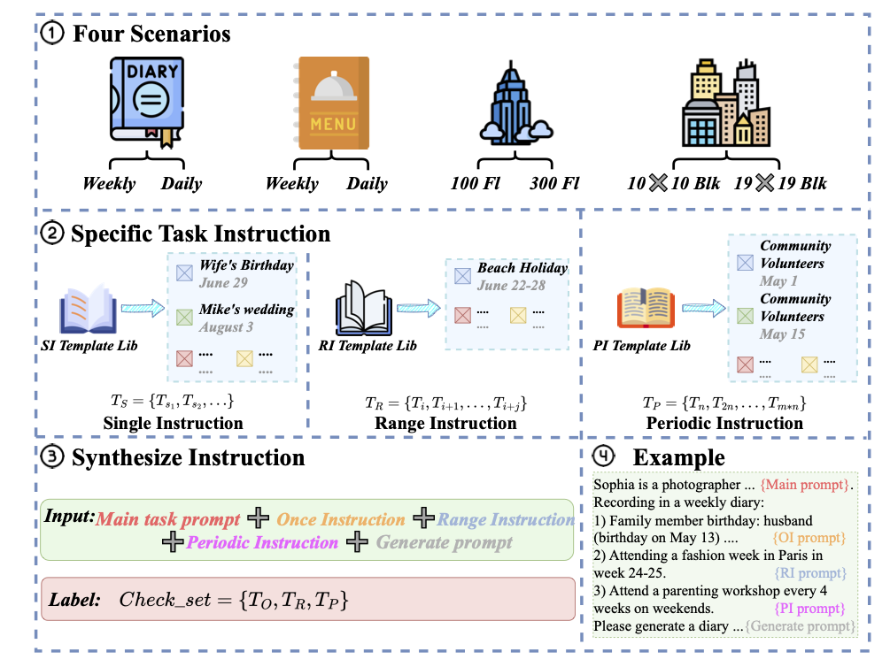

# Spinning the Golden Thread: Benchmarking Long-Form Generation in Language Models

<!-- <div style="display: flex; justify-content: center; align-items: center;">
    
</div> -->


This repository provides the code and data for the paper **"Spinning the Golden Thread: Benchmarking Long-Form Generation in Language Models"**.

## Overview
The **Spinning the Golden Thread (SGT)** benchmark is designed to assess the long-form content generation abilities of language models (LMs) for tasks requiring coherent, long-context outputs. Traditional benchmarks often focus on short-context tasks or specific information retrieval, such as the Needle-in-a-Haystack (NIAH) tests. In contrast, SGT is engineered to probe the abilities of LMs to generate extended text sequences that are coherent and contextually rich, while adhering to detailed prompt instructions involving various constraints.

## Benchmark Design 


The benchmark evaluates 10 long-context LMs over a series of four scenarios with multiple sub-scenarios, each varying by the type of prompt instructions—single instance, range, and periodicity. These scenarios simulate real-world tasks such as urban planning, diary entries, or menu planning, where the LM must incorporate specific events, details, or constraints into a long-form text sequence.

## Evaluation Focus
SGT particularly emphasizes the model's capability to follow complex instructions over long text generation tasks, challenging the models with prompt lengths set at 16K and 32K tokens. This setup tests the models' endurance in maintaining coherence and relevance over long stretches of text, a critical measure for applications in fields like automated content creation, academic summarization, and narrative generation.


## Run

### Clone this repository:

```bash
git clone git@github.com:mozhu621/SGT.git
cd SGT
pip install -r requirements.txt
```

### Evalution :
```bash
cd ./Evalution
bash Run_short_all_small_model.sh
bash Run_short_all_large_model.sh
bash Run_long_all_small_model.sh
bash Run_long_all_large_model.sh
```

### Static:
```bash
cd ./Evalution/results
Run all cells in sequence --- static.ipynb
```
## Citation

If you find this work useful in your research, please cite our paper:

```bibtex
@article{wu2024spinning,
  title={Spinning the Golden Thread: Benchmarking Long-Form Generation in Language Models},
  author={Wu, Yuhao and Hee, Ming Shan and Hu, Zhiqing and Lee, Roy Ka-Wei},
  journal={arXiv preprint arXiv:2409.02076},
  year={2024}
}
